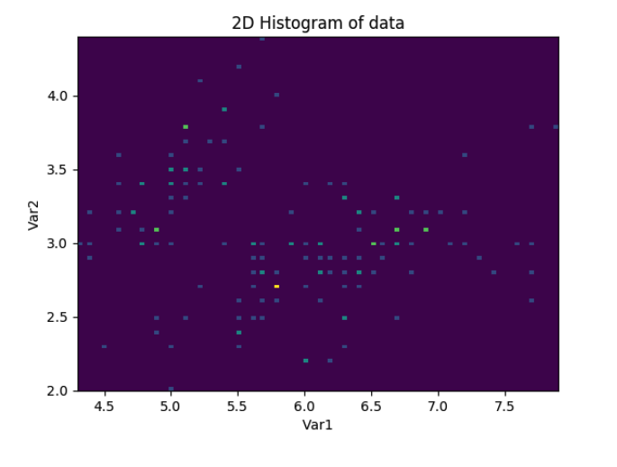
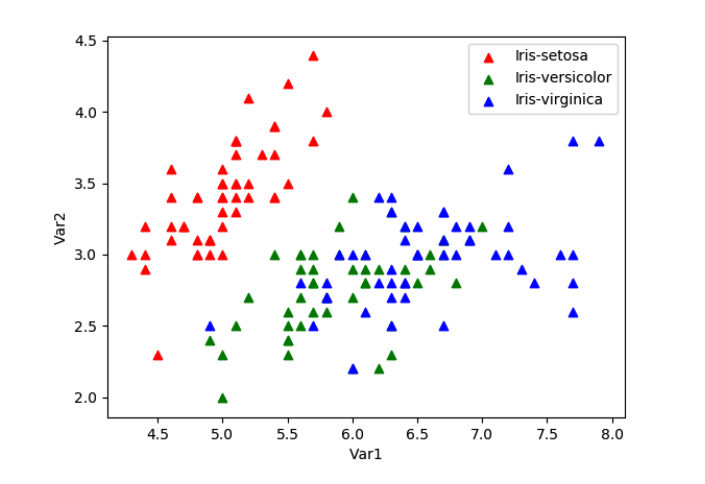

# Gradient Descent and Stochastic Gradient Descent

## Introduction
This project explores the implementation of Gradient Descent and Stochastic Gradient Descent algorithms for linear regression. It involves data preprocessing, model training, and evaluation using the Iris dataset.

## Libraries Used
- Pandas
- NumPy
- Matplotlib
- Scikit-learn

## Dataset
The Iris dataset is used for this project. It can be downloaded from the UCI Machine Learning Repository: [Iris Dataset](https://archive.ics.uci.edu/ml/datasets/iris).

## Implementation
The project includes the following key steps:
1. Data preprocessing and visualization.
2. Implementation of Gradient Descent and Stochastic Gradient Descent algorithms.
3. Model evaluation using training and test datasets.

## Results
The performance of the models is evaluated based on the Sum of Squared Errors (SSE) on the training and test datasets.

### 2D Histogram of Data

### 3D Histogram of Data

### Scatter Plot of Data

### Mean and Variance of Features

### Covariance Matrix

### Correlation Matrix

### Gaussian Distribution of Features

### Mutual Information

## Conclusion
The Gradient Descent and Stochastic Gradient Descent algorithms were successfully implemented and evaluated using the Iris dataset. The results demonstrate the effectiveness of these algorithms in linear regression tasks.
